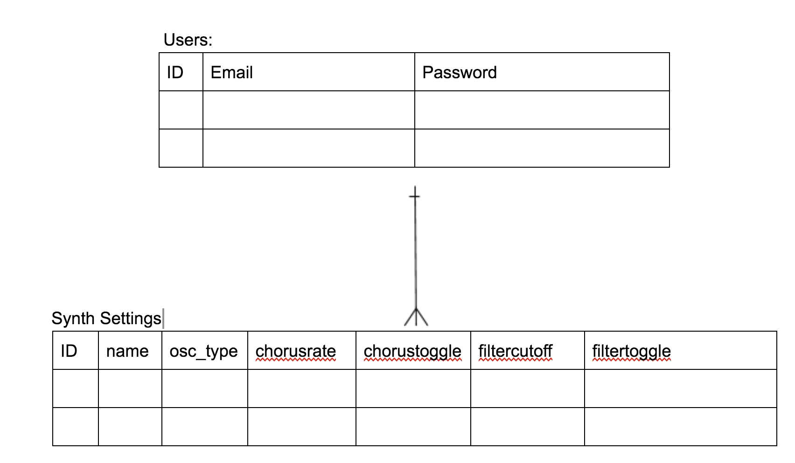

## Welcome to the JSynth API repo

##### This API is designed to accompany the JSynth web browser client. It stores user information including login credentials and effects settings.



### Links:
* [API repo](https://github.com/j-gottlieb/jsynth-api)
* [Client repo](https://github.com/j-gottlieb/jsynth-jquery-client)
* [Deployed API](https://jsynth-api.herokuapp.com/)
* [Deployed Client](https://j-gottlieb.github.io/jsynth-jquery-client/)

### Planning:

From the beginning, I knew this API would be relatively simple. The majority of the work on this project would happen on the front-end. It would be just a users resource and a synth_settings resource.

Being brutally honest with myself, the majority of my difficulties stemmed from being over-confident in my Rails ability. I initially set it it up very quickly and achieved what I thought were correct results. However I later discovered that I hadn't used a foreign key when I needed to.

Later, I blindly copied and pasted from a previous project believing that it was exactly the same as my current situation, but of course it was not. After a lot of struggle I realized that I had validated my synth_settings by uniqueness of name, which was definitely not what I wanted.

This process taught me that I should never be to confident in my abilities and to ALWAYS read the docs!!!

### Technologies Used
* Ruby
* Ruby on Rails
* Heroku

### Unsolved Issues:

I would like to add more columns to my table for more effects.

### Setup and Installation:

1. Download template, unzip and rename
2. bundle install
3. Initialize git and heroku repos
4. Deploy to heroku

## API specifications

### Authentication

| Verb   | URI Pattern            | Controller#Action |
|--------|------------------------|-------------------|
| POST   | `/sign-up`             | `users#signup`    |
| POST   | `/sign-in`             | `users#signin`    |
| PATCH  | `/change-password`     | `users#changepw`  |
| DELETE | `/sign-out`            | `users#signout`   |

#### POST /sign-up

Request:

```sh
curl http://localhost:4741/sign-up \
  --include \
  --request POST \
  --header "Content-Type: application/json" \
  --data '{
    "credentials": {
      "email": "'"${EMAIL}"'",
      "password": "'"${PASSWORD}"'",
      "password_confirmation": "'"${PASSWORD}"'"
    }
  }'
```

```sh
EMAIL=ava@bob.com PASSWORD=hannah curl-scripts/auth/sign-up.sh
```

Response:

```md
HTTP/1.1 201 Created
Content-Type: application/json; charset=utf-8

{
  "user": {
    "id": 1,
    "email": "ava@bob.com"
  }
}
```

#### POST /sign-in

Request:

```sh
curl http://localhost:4741/sign-in \
  --include \
  --request POST \
  --header "Content-Type: application/json" \
  --data '{
    "credentials": {
      "email": "'"${EMAIL}"'",
      "password": "'"${PASSWORD}"'"
    }
  }'
```

```sh
EMAIL=ava@bob.com PASSWORD=hannah curl-scripts/auth/sign-in.sh
```

Response:

```md
HTTP/1.1 200 OK
Content-Type: application/json; charset=utf-8

{
  "user": {
    "id": 1,
    "email": "ava@bob.com",
    "token": "BAhJIiVlZDIwZTMzMzQzODg5NTBmYjZlNjRlZDZlNzYxYzU2ZAY6BkVG--7e7f77f974edcf5e4887b56918f34cd9fe293b9f"
  }
}
```

#### PATCH /change-password

Request:

```sh
curl --include --request PATCH "http://localhost:4741/change-password" \
  --header "Authorization: Token token=$TOKEN" \
  --header "Content-Type: application/json" \
  --data '{
    "passwords": {
      "old": "'"${OLDPW}"'",
      "new": "'"${NEWPW}"'"
    }
  }'
```

```sh
OLDPW='hannah' NEWPW='elle' TOKEN='BAhJIiVlZDIwZTMzMzQzODg5NTBmYjZlNjRlZDZlNzYxYzU2ZAY6BkVG--7e7f77f974edcf5e4887b56918f34cd9fe293b9f' sh curl-scripts/auth/change-password.sh
```

Response:

```md
HTTP/1.1 204 No Content
```

#### DELETE /sign-out

Request:

```sh
curl http://localhost:4741/sign-out \
  --include \
  --request DELETE \
  --header "Authorization: Token token=$TOKEN"
```

```sh
TOKEN='BAhJIiVlZDIwZTMzMzQzODg5NTBmYjZlNjRlZDZlNzYxYzU2ZAY6BkVG--7e7f77f974edcf5e4887b56918f34cd9fe293b9f' sh curl-scripts/auth/sign-out.sh
```

Response:

```md
HTTP/1.1 204 No Content
```

### Users

| Verb | URI Pattern | Controller#Action |
|------|-------------|-------------------|
| GET  | `/users`    | `users#index`     |
| GET  | `/users/1`  | `users#show`      |
| PATCH| `/users/1`  | `users#update`    |

#### GET /users

Request:

```sh
curl http://localhost:4741/users \
  --include \
  --request GET \
  --header "Authorization: Token token=$TOKEN"
```

```sh
TOKEN=BAhJIiVlZDIwZTMzMzQzODg5NTBmYjZlNjRlZDZlNzYxYzU2ZAY6BkVG--7e7f77f974edcf5e4887b56918f34cd9fe293b9f curl-scripts/users.sh
```

Response:

```md
HTTP/1.1 200 OK
Content-Type: application/json; charset=utf-8

{
  "users": [
    {
      "id": 2,
      "email": "bob@ava.com"
    },
    {
      "id": 1,
      "email": "ava@bob.com"
    }
  ]
}
```

#### GET /users/:id

Request:

```sh
curl --include --request GET http://localhost:4741/users/$ID \
  --header "Authorization: Token token=$TOKEN"
```

```sh
ID=2 TOKEN=BAhJIiVlZDIwZTMzMzQzODg5NTBmYjZlNjRlZDZlNzYxYzU2ZAY6BkVG--7e7f77f974edcf5e4887b56918f34cd9fe293b9f curl-scripts/user.sh
```

Response:

```md
HTTP/1.1 200 OK
Content-Type: application/json; charset=utf-8

{
  "user": {
    "id": 2,
    "email": "bob@ava.com"
  }
}
```

#### PATCH /users/:id

Request:

```sh
curl "http://localhost:4741/users/${ID}" \
  --include \
  --request PATCH \
  --header "Authorization: Token token=${TOKEN}" \
  --header "Content-Type: application/json" \
  --data '{
    "user": {
      "email": "'"${EMAIL}"'"
    }
  }'
```

```sh
ID=1 TOKEN="BAhJIiU1NGNlYjRmMjBhM2NkZTZiNzk1MGNiYmZiYWMyY2U4MwY6BkVG--ddb1e16af0e05921aa56d771e4a2f816f2a1d46e"
EMAIL=mike@m
sh curl-scripts/users/user-update.sh
```

Response:

```md
HTTP/1.1 200 OK
Content-Type: application/json; charset=utf-8

{"user":{"id":1,"email":"mike@m"}}
```

### Synth_Settings

| Verb   | URI Pattern            | Controller#Action |
|--------|------------------------|-------------------|
| POST   | `/synth_settings`      | `synth_settings#create`    |
| GET    | `/synth_settings`      | `synth_settings#index`    |
| PATCH  | `/synth_settings/:id`  | `synth_settings#update`  |
| DELETE | `/synth_settings/:id`  | `synth_settings#destroy`   |

#### POST /synth_settings

Request:

```sh
curl "http://localhost:4741/synth_settings" \
  --include \
  --request POST \
  --header "Content-Type: application/json" \
  --header "Authorization: Token token=${TOKEN}" \
  --data '{
    "synth_setting": {
      "name": "'"${NAME}"'",
      "oscillator_type": "'"${TYPE}"'",
      "chorusrate": "'"${CHORUSRATE}"'",
      "chorustoggle": "'"${CHORUSTOGGLE}"'",
      "filtercutoff": "'"${FILTERCUTOFF}"'",
      "filtertoggle": "'"${FILTERTOGGLE}"'"
    }
  }'
```

```sh
TOKEN='BAhJIiVlZDIwZTMzMzQzODg5NTBmYjZlNjRlZDZlNzYxYzU2ZAY6BkVG--7e7f77f974edcf5e4887b56918f34cd9fe293b9f' NAME=Setting TYPE=sine CHORUSRATE=4 CHORUSTOGGLE=true FILTERCUTOFF=1000 FILTERTOGGLE=true sh curl-scripts/synth/create-synth.sh
```

Response:

```md
HTTP/1.1 201 Created
Content-Type: application/json; charset=utf-8

{
  "synth_setting": {
    "name": "Setting",
    "oscillator_type": "sine",
    "chorusrate": "4",
    "chorustoggle": "true",
    "filtercutoff": "1000",
    "filtertoggle": "true"
  }
  }
}
```

#### PATCH /synth_settings/:id

Request:

```sh
curl "http://localhost:4741/synth_settings/${ID}" \
  --include \
  --request PATCH \
  --header "Content-Type: application/json" \
  --header "Authorization: Token token=${TOKEN}" \
  --data '{
    "synth_setting": {
      "name": "'"${NAME}"'",
      "type": "'"${TYPE}"'",
      "chorusrate": "'"${CHORUSRATE}"'",
      "chorustoggle": "'"${CHORUSTOGGLE}"'",
      "filtercutoff": "'"${FILTERCUTOFF}"'",
      "filtertoggle": "'"${FILTERTOGGLE}"'"
    }
  }'
```

```sh
TOKEN='BAhJIiVlZDIwZTMzMzQzODg5NTBmYjZlNjRlZDZlNzYxYzU2ZAY6BkVG--7e7f77f974edcf5e4887b56918f34cd9fe293b9f' ID=1 NAME=Setting TYPE=sine CHORUSRATE=4 CHORUSTOGGLE=true FILTERCUTOFF=1000 FILTERTOGGLE=true sh curl-scripts/synth/create-synth.sh
```

Response:

```md
HTTP/1.1 204 No Content
```

#### DELETE /synth_settings/:id

Request:

```sh
curl "http://localhost:4741/synth_settings/${ID}" \
  --include \
  --request DELETE \
  --header "Content-Type: application/json" \
  --header "Authorization: Token token=${TOKEN}" \
```

```sh
TOKEN='BAhJIiVlZDIwZTMzMzQzODg5NTBmYjZlNjRlZDZlNzYxYzU2ZAY6BkVG--7e7f77f974edcf5e4887b56918f34cd9fe293b9f' ID=1 sh curl-scripts/auth/sign-out.sh
```

Response:

```md
HTTP/1.1 204 No Content
```
